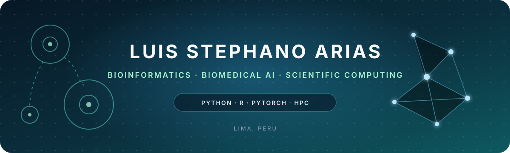

  

  
  
  

<samp>

  Systems Engineering undergraduate working at the intersection of 
  <strong>computational biology, biomedical imaging, and machine learning.</strong>

  Remote bioinformatics project experience connected to ETH Zurich and the University of Bern, 
  from bacterial genome annotation on HPC to single-cell transcriptomics and immune-cell analysis.

</samp>

 

## focus

<table>
  <tr>
    <td width="33%" valign="top">
      <h3 align="center">Biomedical AI</h3>
      
Computer vision for microscopy, CNNs, Vision Transformers, and evidence-based model evaluation.

    </td>
    <td width="33%" valign="top">
      <h3 align="center">Bioinformatics</h3>
      
Single-cell RNA sequencing, genomics, biological data exploration, and immune-cell annotation.

    </td>
    <td width="33%" valign="top">
      <h3 align="center">Scientific Computing</h3>
      
Reproducible workflows with Python, R, Linux, Bash, Git, and high-performance computing.

    </td>
  </tr>
</table>

## current research direction

> Developing an undergraduate thesis project around **Vision Transformers and two-photon microscopy** to characterize innate immune-cell responses associated with inflammation, tissue repair, immune polarization, and post-surgical adhesions.

  
  
  
  

## selected work

<table>
  <tr>
    <td colspan="2" valign="top">
      <h3><a href="https://github.com/luisarias2680/peru-logistics-address-normalizer">Peruvian Logistics Address Normalizer</a></h3>
      
Privacy-aware Python pipeline and local FastAPI interface for cleaning, parsing, matching, and geocoding logistics addresses. Includes explainable review states, provider safeguards, and 72 automated tests.

      

        
        
        
        
      

    </td>
  </tr>
  <tr>
    <td width="50%" valign="top">
      <h3><a href="https://github.com/luisarias2680/IMAGE-CLASSIFICATION-KNN-PCA">Image Classification · PCA + KNN</a></h3>
      
Classical machine-learning pipeline for image preprocessing, dimensionality reduction, classification, evaluation, and reusable model export.

      

        
        
      

    </td>
    <td width="50%" valign="top">
      <h3><a href="https://github.com/luisarias2680/binary-classification-w-tensorflow">Binary Image Classification</a></h3>
      
Transfer-learning experiments with TensorFlow InceptionV3 and PyTorch ResNet18, with transparent notes on evaluation and reproducibility.

      

        
        
      

    </td>
  </tr>
  <tr>
    <td width="50%" valign="top">
      <h3><a href="https://github.com/luisarias2680/STOCK-PREDICTION-RNN">Time-Series Forecasting · LSTM</a></h3>
      
Educational sequence-modeling experiment using historical Google stock data, a 60-day window, and a stacked LSTM architecture.

      

        
        
      

    </td>
    <td width="50%" valign="top">
      <h3><a href="https://github.com/luisarias2680/genomic-deep-learning-labs">Genomic Deep Learning Study Labs</a></h3>
      
Nine Spanish-language notebooks covering ML foundations, DNA representations, genomic CNNs, motif discovery, CTCF binding examples, and recurrent sequence models.

      

        
        
        
      

    </td>
  </tr>
</table>

## scientific stack

  
  
  
  
  

  
  
  
  
  
  

  
  
  
  
  

  
  
  
  
  

## research snapshot

- **Single-cell transcriptomics:** exploration of human and mouse scRNA-seq data, immune-cell annotation, and gene-expression analysis.
- **Genomics and microbiome:** large-scale bacterial genome annotation using whole-genome sequencing, culturomics data, Python, Bash, and HPC workflows.
- **Biomedical computer vision:** image classification with deep learning and classical ML, with a current focus on microscopy and Vision Transformers.

 

  <samp>building careful computational tools for complex biological questions</samp>

  <a href="mailto:luis.st.arias@outlook.com">luis.st.arias@outlook.com</a>
  &nbsp;·&nbsp; Lima, Peru

